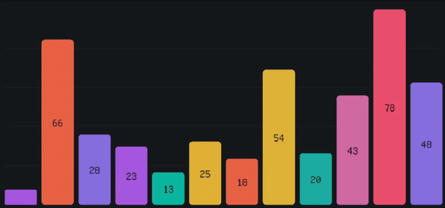
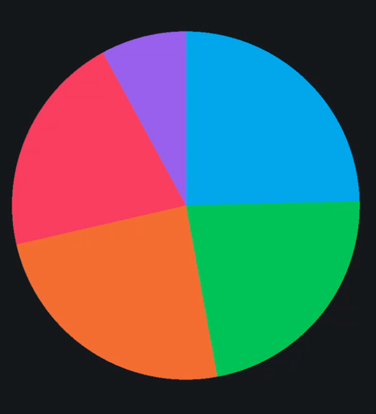
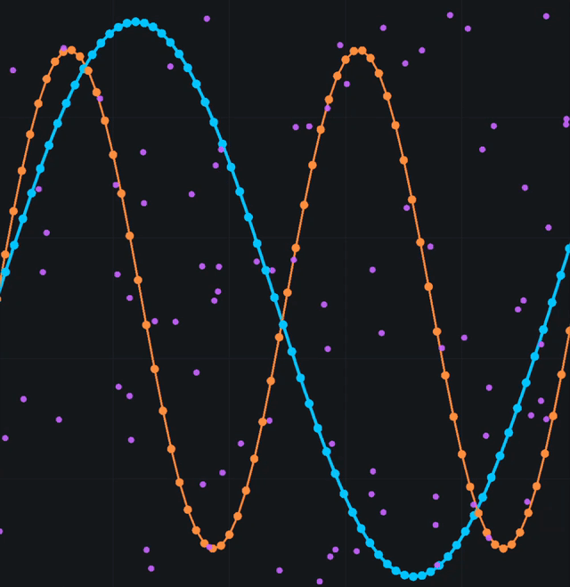
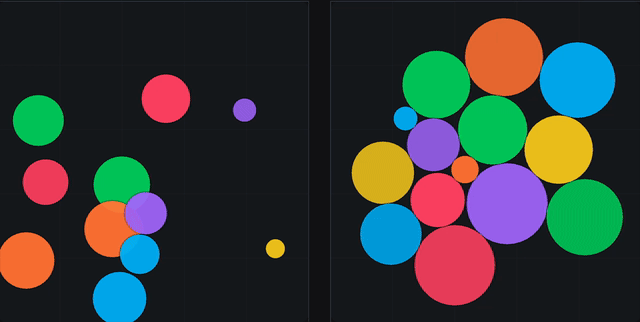
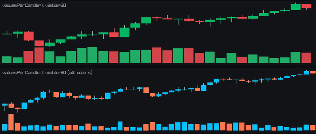
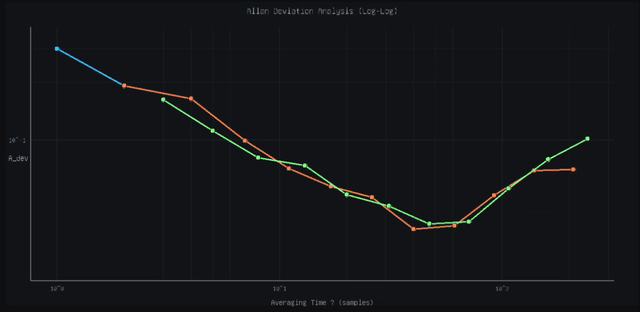
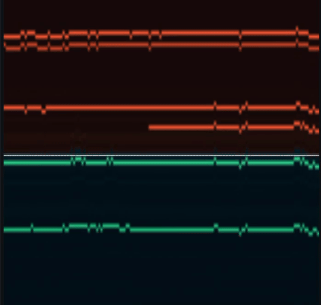
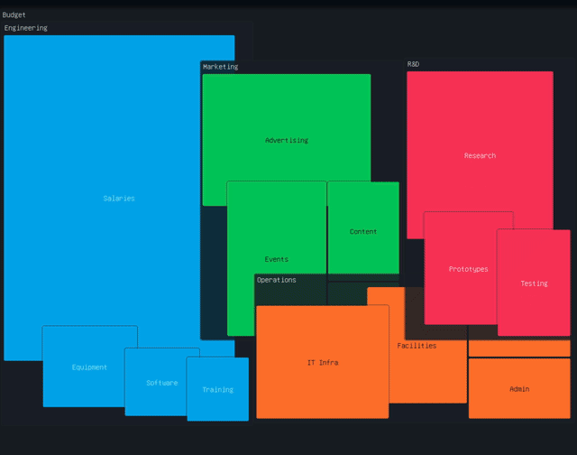

# 📊 cpp-charts


[](https://github.com/andersc/cpp-charts/actions/workflows/windows.yml)
[](https://github.com/andersc/cpp-charts/actions/workflows/ubuntu_x86_64.yml)
[](https://github.com/andersc/cpp-charts/actions/workflows/MacOS.yml)
[](https://opensource.org/licenses/MIT)
[](https://andersc.github.io/cpp-charts/)

## The Problem

Let's face it: there is no really simple C++ library for great-looking graphs. Most visualization libraries are either:
- Too heavy-weight with complex dependencies
- Designed for Python or JavaScript
- Lack modern, animated, beautiful aesthetics
- Difficult to integrate into existing C++ projects

**cpp-charts** solves this by providing a lightweight, header-friendly, beautifully animated charting library built on [raylib](https://www.raylib.com/), making it incredibly easy to add professional-looking visualizations to your C++ applications.

---

## ✨ Features

**cpp-charts** provides a comprehensive suite of animated, customizable chart types:

- 📊 **Bar Charts** - Vertical and horizontal orientations with smooth animations
- 🥧 **Pie Charts** - Classic pie and donut charts with slice animations
- 📈 **Scatter Plots** - Data point visualization with customizable markers
- 📈 **Area Charts** - Overlapped, stacked, and 100% stacked area charts with smooth transitions
- 🫧 **Bubble Charts** - Multi-dimensional data visualization
- 🕯️ **Candlestick Charts** - Financial data visualization (OHLC)
- 🌡️ **Gauges** - Circular and semi-circular gauge displays
- 📏 **Linear Gauges** - Horizontal/vertical progress gauges with range bands and pointer styles
- 🎚️ **VU Meters** - Multi-channel volume meters with peak hold, clip indicators, and dB scale
- 🗺️ **Heat Maps** - Matrix data visualization with color gradients
- 🏔️ **3D Heat Maps** - 3D surface visualization with palette-based coloring and smooth transitions
- 📉 **Log-Log Plots** - Real-time streaming time series with Allan variance-style analysis and dynamic confidence intervals
- 📈 **Time Series** - High-performance streaming time series with multiple traces and spline interpolation
- 📊 **Order Book** - Full depth-of-market visualization with 2D heatmap and 3D landscape views
- 🌳 **Tree Maps** - D3-style hierarchical data visualization with squarified layout
- 🕸️ **Radar Charts** - Spider/radar charts with multiple series and smooth morphing animations
- 🔀 **Sankey Diagrams** - Flow visualization with weighted connections and smooth ribbon curves

**All charts feature:**
- 🎬 Smooth, configurable animations
- 🎨 Full color and styling customization
- 📐 Automatic scaling and layout
- 🏷️ Label support with smart positioning
- 🔤 Custom font support (load your own TTF fonts)
- ⚡ High performance with raylib rendering
- 🖱️ Responsive design with various display modes

**All demos use the bundled `base.ttf` font for consistent, readable text rendering.**

---

## 🌐 Live Web Demos

Try cpp-charts directly in your browser! All demos are compiled to WebAssembly and automatically deployed on every push to main.

**👉 [Launch Live Demos](https://andersc.github.io/cpp-charts/)**

See the [wasm/](wasm/) directory for build instructions if you want to compile the demos yourself.

---


## 📚 Detailed Chart Documentation

For comprehensive documentation on each chart type, including full API references and examples:

| Chart Type | Description | Documentation |
|------------|-------------|---------------|
| 📈 Area Chart | Overlapped/stacked area charts | [RLAreaChart.md](docs/RLAreaChart.md) |
| 📊 Bar Chart | Vertical/horizontal bar charts | [RLBarChart.md](docs/RLBarChart.md) |
| 🫧 Bubble Chart | Scatter/gravity bubble visualization | [RLBubble.md](docs/RLBubble.md) |
| 🕯️ Candlestick | Financial OHLCV charts | [RLCandlestickChart.md](docs/RLCandlestickChart.md) |
| 🌡️ Gauge | Circular gauge displays | [RLGauge.md](docs/RLGauge.md) |
| 🗺️ Heat Map | Matrix color visualization | [RLHeatMap.md](docs/RLHeatMap.md) |
| 🏔️ 3D Heat Map | 3D surface visualization | [RLHeatMap3D.md](docs/RLHeatMap3D.md) |
| 📏 Linear Gauge | Horizontal/vertical progress gauges | [RLLinearGauge.md](docs/RLLinearGauge.md) |
| 📉 Log-Log Plot | Allan variance analysis | [RLLogPlot.md](docs/RLLogPlot.md) |
| 📊 Order Book | DOM depth heatmap (2D/3D) | [RLOrderBookVis.md](docs/RLOrderBookVis.md) |
| 🥧 Pie Chart | Pie and donut charts | [RLPieChart.md](docs/RLPieChart.md) |
| 🕸️ Radar Chart | Spider/radar multi-series charts | [RLRadarChart.md](docs/RLRadarChart.md) |
| 🔀 Sankey Diagram | Flow visualization with ribbons | [RLSankey.md](docs/RLSankey.md) |
| 📈 Scatter Plot | Multi-series scatter/line plots | [RLScatterPlot.md](docs/RLScatterPlot.md) |
| 📊 Time Series | Streaming time series | [RLTimeSeries.md](docs/RLTimeSeries.md) |
| 🌳 Tree Map | D3-style hierarchical treemap | [RLTreeMap.md](docs/RLTreeMap.md) |

---

## 🚀 Quick Start

Using cpp-charts is incredibly simple. Here's a complete example creating an animated bar chart:

```cpp
#include "RLBarChart.h"
#include <vector>

int main() {
    InitWindow(800, 600, "My First Chart");
    SetTargetFPS(60);
    
    // Define your chart area
    Rectangle bounds = { 50, 50, 700, 500 };
    
    // Create bar chart with vertical orientation
    RLBarChart chart(bounds, RLBarOrientation::VERTICAL);
    
    // Prepare your data
    std::vector<RLBarData> data;
    data.push_back({75.0f, BLUE, false, BLACK, "Q1"});
    data.push_back({92.0f, GREEN, false, BLACK, "Q2"});
    data.push_back({68.0f, RED, false, BLACK, "Q3"});
    data.push_back({85.0f, ORANGE, false, BLACK, "Q4"});
    
    // Set the data
    chart.setData(data);
    
    while (!WindowShouldClose()) {
        float dt = GetFrameTime();
        chart.update(dt);  // Animate
        
        BeginDrawing();
        ClearBackground(RAYWHITE);
        chart.draw();      // Render
        EndDrawing();
    }
    
    CloseWindow();
    return 0;
}
```

That's it! You get a beautiful, animated bar chart with just a few lines of code.

---

## 🧩 Chart Examples

### Pie Chart

```cpp
#include "RLPieChart.h"

RLPieChart chart(bounds);
chart.setHollowFactor(0.5f);  // Makes it a donut chart

std::vector<RLPieSliceData> slices;
slices.push_back({30.0f, BLUE, "Sales"});
slices.push_back({25.0f, GREEN, "Marketing"});
slices.push_back({45.0f, RED, "R&D"});

chart.setData(slices);
```

### Scatter Plot

```cpp
#include "RLScatterPlot.h"

RLScatterPlot chart(bounds);

std::vector<RLScatterPoint> points;
for (int i = 0; i < 100; i++) {
    points.push_back({
        (float)i, 
        std::sin(i * 0.1f) * 50.0f, 
        SKYBLUE
    });
}

chart.setData(points);
```

### Candlestick Chart (Financial Data)

```cpp
#include "RLCandlestickChart.h"

RLCandlestickChart chart(bounds);

std::vector<RLCandleData> candles;
candles.push_back({100.0f, 110.0f, 95.0f, 105.0f});  // Open, High, Low, Close
candles.push_back({105.0f, 115.0f, 103.0f, 112.0f});
// ... more candles

chart.setData(candles);
```

### Gauge

```cpp
#include "RLGauge.h"

RLGauge gauge(bounds);
gauge.setRange(0.0f, 100.0f);
gauge.setValue(75.0f);  // Smoothly animates to 75%
```

### Log-Log Plot (Real-Time Analysis)

```cpp
#include "RLLogPlot.h"

RLLogPlot plot(bounds);
plot.setWindowSize(500);  // Keep last 500 samples

// Stream time series data
while (running) {
    float sample = getSensorData();
    plot.pushSample(sample);
    
    // Update analysis periodically
    if (shouldUpdateAnalysis) {
        RLLogPlotTrace trace;
        trace.mXValues = computedTau;      // e.g., [1, 2, 5, 10, 20, ...]
        trace.mYValues = allanDeviation;   // Analysis results
        trace.mConfidence = confidenceIntervals;
        trace.mStyle.mLineColor = SKYBLUE;
        plot.addTrace(trace);
    }
    
    plot.update(dt);
    plot.draw();
}
```

### Time Series (Streaming)

```cpp
#include "RLTimeSeries.h"

RLTimeSeries chart(bounds, 500);  // 500 sample window

// Add a trace
RLTimeSeriesTraceStyle traceStyle;
traceStyle.mColor = Color{80, 200, 255, 255};
traceStyle.mLineMode = RLTimeSeriesLineMode::Linear;
size_t traceIdx = chart.addTrace(traceStyle);

// Stream data
float sample = getSensorData();
chart.pushSample(traceIdx, sample);

chart.update(dt);
chart.draw();
```

### Area Chart

```cpp
#include "RLAreaChart.h"

RLAreaChart chart(bounds, RLAreaChartMode::STACKED);

std::vector<RLAreaSeries> series;

RLAreaSeries s1;
s1.mLabel = "Product A";
s1.mColor = Color{80, 180, 255, 255};
s1.mValues = {10, 15, 20, 25, 30, 28, 32};
series.push_back(s1);

RLAreaSeries s2;
s2.mLabel = "Product B";
s2.mColor = Color{255, 120, 80, 255};
s2.mValues = {8, 12, 18, 22, 18, 20, 24};
series.push_back(s2);

chart.setData(series);

// Smooth transition to new data
chart.setTargetData(newSeries);

chart.update(dt);
chart.draw();
```

---

## 📦 Integration into Your Project

### You need to have the following dependencies installed:
- [raylib](https://www.raylib.com/) 5.0 or higher
- [zlib](https://zlib.net/) (for certain features)
- CMake 3.28 or higher

### MacOS (using Homebrew):

```bash
brew install raylib zlib
``` 
### Ubuntu (using apt):

```bash
sudo apt install libasound2-dev libx11-dev libxrandr-dev libxi-dev libgl1-mesa-dev libglu1-mesa-dev libxcursor-dev libxinerama-dev libwayland-dev libxkbcommon-dev zlib1g-dev
cd (temporary directory or where you want to build raylib)
git clone --branch 5.5 https://github.com/raysan5/raylib.git raylib
cd raylib
mkdir build && cd build
cmake -DBUILD_SHARED_LIBS=ON ..
make
sudo make install
sudo ldconfig

```
### Windows:

install cmake and git for windows, then run the following commands in a terminal (git bash),
See the windows build actions for reference. The below builds the x86_64 binaries for arm change the architecture in the cmake generator line.


```bash
cd (temporary directory or where you want to build zlib)
git clone --branch v1.3.1 https://github.com/madler/zlib.git
cd zlib
cmake -S . -DCMAKE_BUILD_TYPE=Release
cmake --build . --target install --config Release

cd (temporary directory or where you want to build raylib)
git clone --branch 5.5 https://github.com/raysan5/raylib.git
cd raylib
mkdir build
cd build
cmake -G "Visual Studio 17 2022" -A x64 ..
cmake --build . --config Release
cmake --install . --config Release
```

### Method 1: Using CMake FetchContent (Recommended)

(See test_build/CMakeLists.txt for full example)

Example `CMakeLists.txt`:

```cmake
cmake_minimum_required(VERSION 3.28)
project(single_guage)

set(CMAKE_CXX_STANDARD 20)

find_package (raylib 5.0 REQUIRED)
find_package (ZLIB REQUIRED)
find_package (Threads REQUIRED)

message("Including raylib from: " ${raylib_INCLUDE_DIRS})
message("Including ZLIB from: " ${ZLIB_INCLUDE_DIRS})

include_directories(${raylib_INCLUDE_DIRS})
include_directories(${ZLIB_INCLUDE_DIRS})

include(FetchContent)
FetchContent_Declare(
        cpp_charts
        GIT_REPOSITORY https://github.com/andersc/cpp-charts.git
        GIT_TAG main  # specify a version or branch if needed
        CONFIGURE_COMMAND ""
        BUILD_COMMAND ""
        INSTALL_COMMAND ""
        TEST_COMMAND ""
)
FetchContent_MakeAvailable(cpp_charts)

message("Including cpp.charts from: " ${cpp_charts_SOURCE_DIR}/src/charts)
message("and RLCommon.h from: " ${cpp_charts_SOURCE_DIR}/src)
include_directories(${cpp_charts_SOURCE_DIR}/src/charts)
include_directories(${cpp_charts_SOURCE_DIR}/src)

add_executable(single_guage
        ${CMAKE_CURRENT_SOURCE_DIR}/single_guage.cpp
        ${cpp_charts_SOURCE_DIR}/src/charts/RLGauge.cpp
)
target_link_libraries(single_guage
        raylib
        Threads::Threads
)
if(WIN32)
    target_link_libraries(single_guage winmm)
endif()


```

### Method 2: Using CMake ExternalProject_Add

```cmake
include(ExternalProject)

ExternalProject_Add(
    cpp_charts_external
    GIT_REPOSITORY https://github.com/andersc/cpp-charts.git
    GIT_TAG main
    PREFIX ${CMAKE_BINARY_DIR}/external/cpp-charts
    CONFIGURE_COMMAND ""
    BUILD_COMMAND ""
    INSTALL_COMMAND ""
)
ExternalProject_Get_Property(cpp_charts_external SOURCE_DIR)
add_executable(my_app main.cpp)
add_dependencies(my_app cpp_charts_external)

target_include_directories(my_app PRIVATE 
    ${SOURCE_DIR}/src/charts
    ${SOURCE_DIR}/src
)

target_sources(my_app PRIVATE
    ${SOURCE_DIR}/src/charts/RLBarChart.cpp
    ${SOURCE_DIR}/src/charts/RLPieChart.cpp
    # ... other chart sources as needed
)
```

### Method 3: Git Submodule

```bash
# Add as submodule
git submodule add https://github.com/andersc/cpp-charts.git external/cpp-charts
git submodule update --init --recursive
```

Then in your `CMakeLists.txt`:

```cmake
# Include the chart headers
include_directories(external/cpp-charts/src/charts)
include_directories(external/cpp-charts/src)

# Add to your executable
add_executable(my_app 
    main.cpp
    external/cpp-charts/src/charts/RLBarChart.cpp
    external/cpp-charts/src/charts/RLPieChart.cpp
    # ... other charts as needed
)

target_link_libraries(my_app raylib)

if(WIN32)
    target_link_libraries(my_app winmm)
endif()
```

### Method 4: Direct Copy

Simply copy the `src/charts/` folder into your project and include the headers and source files you need.

---

## 🌐 WebAssembly Build

cpp-charts can be compiled to WebAssembly, allowing all demos to run directly in web browsers!

### Quick Start

```bash
# Install Emscripten SDK first (see wasm/README.md for details)
cd wasm
./build.sh

# Serve the demos
cd build
python3 -m http.server 8080
# Open http://localhost:8080 in your browser
```

### Features

- 🎮 All 13 chart demos compiled to WebAssembly
- 🎨 Beautiful custom landing page with dark theme
- ⚡ Fast loading with progress indicator
- 📱 Fullscreen support
- 🔧 Self-contained build (fetches raylib 5.5 automatically)

For complete build instructions, prerequisites, and troubleshooting, see **[wasm/README.md](wasm/README.md)**.

---

## 🎨 Customization

All charts support extensive styling. Here's an example with a bar chart:

```cpp
RLBarChartStyle style;
style.mBackground = Color{20, 22, 28, 255};
style.mShowGrid = true;
style.mGridColor = Color{40, 44, 52, 255};
style.mPadding = 20.0f;
style.mSpacing = 15.0f;
style.mCornerRadius = 8.0f;
style.lAnimateSpeed = 10.0f;
style.mAutoScale = true;

RLBarChart chart(bounds, RLBarOrientation::VERTICAL, style);
```

Each chart type has its own style structure with full control over colors, animations, spacing, and visual effects.

---

## 🔧 Building the Examples

```bash
# Clone the repository
git clone https://github.com/andersc/cpp-charts.git
cd cpp-charts

# Create build directory
mkdir build && cd build

# Configure (make sure raylib is installed)
cmake ..

# Build all examples
cmake --build . --config Release

# Run an example
./raylib_barchart      # Linux/Mac
./raylib_piechart      # Linux/Mac
Release\raylib_barchart.exe    # Windows
```

---

## 🧪 Testing

cpp-charts includes a comprehensive test suite using [doctest](https://github.com/doctest/doctest). Tests cover:

- **RLCommon utilities** - Math functions (clamp, lerp, color interpolation, etc.)
- **Chart logic** - Value clamping, animation convergence, data handling
- **Instantiation** - All chart types can be created without conflicts

### Running Tests Locally

```bash
# Build and run tests
cd build
cmake ..
cmake --build .
ctest --output-on-failure
```

### CI Behavior

Tests run automatically on all platforms via GitHub Actions:

- **Ubuntu** - Full test suite runs with `xvfb-run` for virtual display
- **macOS/Windows** - Math utility tests run; chart tests are skipped (no GPU on CI runners)

To skip raylib-dependent tests locally (e.g., for headless environments):

```bash
CPP_CHARTS_SKIP_RAYLIB=1 ctest --output-on-failure
```

---

## 📋 Requirements

- **CMake** 3.28 or higher
- **C++20** compiler
- **raylib** 5.0 or higher
- **zlib** (for certain features)

---

## 📝 License

This project is licensed under the **MIT License** - see the [LICENSE](LICENSE) file for details.

The MIT License is a permissive license that allows you to:
- ✅ Use commercially
- ✅ Modify
- ✅ Distribute
- ✅ Use privately
- ✅ Sublicense

---

## 🤝 Contributing

**We welcome contributions!** cpp-charts is an open-source project that thrives on community involvement.

### Ways to Contribute:

- 🐛 **Report Bugs** - Found an issue? Open a GitHub issue
- 💡 **Feature Requests** - Have an idea? We'd love to hear it
- 🔧 **Pull Requests** - Fixed a bug or added a feature? Submit a PR
- 📖 **Documentation** - Help improve our docs and examples
- ⭐ **Star the Project** - Show your support!

### Development Guidelines:

1. Fork the repository
2. Create a feature branch (`git checkout -b feature/amazing-feature`)
3. Make your changes
4. Test on your platform
5. Commit your changes (`git commit -m 'Add amazing feature'`)
6. Push to the branch (`git push origin feature/amazing-feature`)
7. Open a Pull Request

### Areas We Need Help:

- 🎨 More chart types (line charts, area charts, radar charts, etc.)
- 🔌 Additional examples and use cases
- 📱 Mobile platform support
- 🧪 Unit tests and benchmarks
- 🌐 Language bindings
- 📚 Tutorials and documentation

---

## 🙏 Acknowledgments

Built with ❤️ using [raylib](https://www.raylib.com/) - a simple and easy-to-use library to enjoy videogames programming.

---

## 📞 Contact

- **Author**: Anders Cedronius
- **GitHub**: [@andersc](https://github.com/andersc)
- **Issues**: [GitHub Issues](https://github.com/andersc/cpp-charts/issues)

---

## 🖼️ Chart Gallery

### Bar Chart


### 3D Heatmap / Scientific plot


### Pie Chart


### Scatter Plot


### Bubble Chart


### Candlestick Chart


### Gauge


### Heat Map


### Log-Log Plot


### Time Series


### Order Book


### Tree Map


### Area Chart


---

**Make your C++ applications beautiful with cpp-charts!** ⭐
