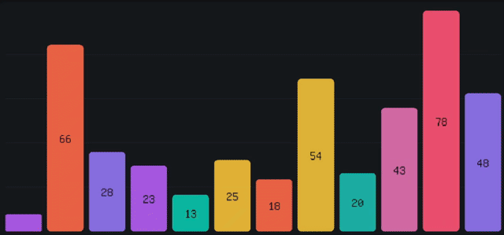

# RLTooltip

Shared tooltip rendering utility for all chart types. Provides a configurable, mouse-following tooltip that draws a rounded box with a title and key-value entries.



## Features

- 🎯 Mouse-following tooltip with configurable offset
- 🎨 Customizable colors, padding, font, and corner radius
- 📐 Automatic screen-edge clamping (never clips off-screen)
- 📝 Title + entry list layout (label: value pairs)
- 🖋️ Supports both default and custom fonts

## Data Structures

### RLTooltipEntry

| Field    | Type          | Default                  | Description                |
|----------|---------------|--------------------------|----------------------------|
| mLabel   | std::string   |                          | Entry label (e.g. "Value") |
| mValue   | std::string   |                          | Entry value (e.g. "42.0")  |
| mColor   | Color         | {200, 200, 210, 255}     | Text color for this entry  |

### RLTooltipStyle

| Field          | Type  | Default                | Description                      |
|----------------|-------|------------------------|----------------------------------|
| mBackground    | Color | {30, 33, 40, 230}      | Tooltip background color         |
| mBorder        | Color | {80, 85, 95, 255}      | Border color                     |
| mTitleColor    | Color | {240, 240, 250, 255}   | Title text color                 |
| mTextColor     | Color | {200, 200, 210, 255}   | Default entry text color         |
| mFontSize      | float | 14.0                   | Font size in pixels              |
| mPadding       | float | 8.0                    | Inner padding                    |
| mBorderWidth   | float | 1.0                    | Border line width                |
| mCornerRadius  | float | 4.0                    | Rounded corner radius            |
| mSpacing       | float | 4.0                    | Vertical spacing between entries |
| mCursorOffset  | float | 16.0                   | Offset from mouse cursor         |
| mFont          | Font  | {}                     | Custom font (default if empty)   |

## Usage

### Drawing a Tooltip

```cpp
#include "RLTooltip.h"

// Inside your draw loop:
std::vector<RLTooltipEntry> lEntries;
lEntries.push_back({"Value", "42.50"});
lEntries.push_back({"Share", "15.3%"});

RLTooltip::draw("Item Name", lEntries, GetMousePosition());
```

### With Custom Style

```cpp
RLTooltipStyle lStyle;
lStyle.mBackground = Color{40, 40, 50, 240};
lStyle.mFontSize = 16.0f;
lStyle.mPadding = 12.0f;

RLTooltip::draw("Custom Tooltip", lEntries, GetMousePosition(), lStyle);
```

## Integrated Charts

The following charts have built-in tooltip support via their style struct:

| Chart          | Style Field       | Default |
|----------------|-------------------|---------|
| RLBarChart     | mShowTooltip      | true    |
| RLPieChart     | mShowTooltip      | true    |
| RLScatterPlot  | mShowTooltip      | true    |

Each chart's style also includes an `mTooltipStyle` field of type `RLTooltipStyle` for customization.
